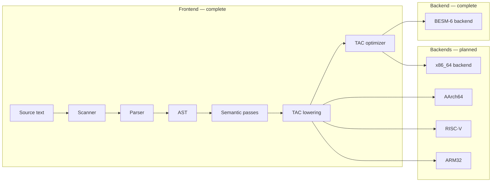

# Multi-Platform C Compiler

A C11 compiler with a shared frontend and pluggable machine backends. Current backend: **BESM-6** (complete). Planned backends: x86_64 (System V AMD64 ABI), AArch64, RISC-V, ARM32. The long-term BESM-6 goal is a self-hosting toolchain for the [Unix v7 port](https://github.com/besm6/v7besm) and the [Dubna monitor](https://github.com/besm6/dubna).

**This repository is unfinished.** The frontend (lexing, parsing, AST, semantic analysis, and full TAC lowering) is complete. The BESM-6 backend is complete; the x86_64 and other backends are planned. Work plans are tracked in [backend/x86/TODO.md](backend/x86/TODO.md) and [backend/besm6/TODO.md](backend/besm6/TODO.md). For file-by-file detail, build options, and tests, see [docs/Technical_Reference.md](docs/Technical_Reference.md).

## Goals

* **Multi-platform**: A single frontend feeds multiple machine backends; adding a new target requires only a new backend directory.
* **Self-hosting**: The compiler should eventually compile itself.
* **Unix v7 kernel**: Target use case includes building the [v7besm](https://github.com/besm6/v7besm) kernel for BESM-6.
* **Dubna integration**: Run naturally under the [Dubna](https://github.com/besm6/dubna) environment.

## Current status (what works today)

| Component | Status |
| --- | --- |
| **`parse`** — C source → AST | Complete (binary `.ast`, or `--yaml` / `--dot` for inspection) |
| **`lower`** — AST → semantic analysis + TAC | Complete (typecheck, full C11 TAC lowering, four-pass optimizer) |
| **TAC** (`tac/`) | Complete (binary export/import, YAML listing, Graphviz DOT) |
| **BESM-6 backend** (`genbesm`) | Complete (peephole-optimized codegen for two assembler dialects — Unix `b6as` (default) and Madlen / Dubna; Bemsh planned) |
| **x86_64 backend** (`genx86`) | Planned — [backend/x86/TODO.md](backend/x86/TODO.md) |
| **AArch64 / RISC-V / ARM32 backends** | Planned |
| **Preprocessor, assembler, linker** | Not in this repo |

The BESM-6 target also ships a **hosted libc subset** as its runtime: `<stdio.h>`
(`printf`/`sprintf`/`snprintf`, `puts`/`putchar`, console I/O), all of `<string.h>` and
the `mem*` family, `<math.h>` helpers (`modf`/`fabs`/`fmin`/`fmax`/`fma`/`frexp`/`ldexp`),
`atoi`, `exit`, and a working `<stdarg.h>`. It builds in two forms — the Madlen `libc.bin`
for the Dubna monitor and the Unix `libc0.a` for the `b6as`/`b6ld`/`b6sim` path; the
dynamic allocator (`malloc`/`calloc`/`realloc`/`free`) is provided in the Unix `libc0.a`
only. Everything else in the headers is declared for future implementation.

`libc0.a` is a *minimal* libc that keeps this repo's own test harnesses self-contained; it
is not installed. The authoritative hosted `libc.a`, `crt0.o`, and standard headers come
from the sibling **v7besm** project. What this repo does install for the Unix path is
`libruntime.a` — the `b$*` helper routines the code generator emits calls to, which are an
implementation detail of this backend and cannot come from anywhere else.

The compiler also has a few deliberate language behaviors — no identifier shadowing, `$` as an
identifier character for BESM-6 runtime helpers, and GCC-style multi-character constant packing —
along with per-component detail. All of this is documented in
[docs/Technical_Reference.md](docs/Technical_Reference.md).

If you only want to try the project: build it, run `parse` on a small `.c` file, and open the YAML or DOT output. You can also feed the `.ast` into `lower` to exercise analysis and TAC emission on supported code. See [Getting started](#getting-started) below.

## How the pieces fit together (architecture)

A compiler is usually described as a pipeline. You can think of it like an assembly line: each stage turns the program into a richer or lower-level representation until it matches the real machine.

1. **Scanner (lexer)** splits the source text into *tokens* (keywords, identifiers, numbers, punctuation).
2. **Parser** builds a *syntax tree* (AST) that matches the grammar of the language.
3. **Semantic analysis** checks meaning: types, scopes, and whether names refer to the right declarations.
4. **Intermediate code** (here, *three-address code*, TAC) is a machine-neutral form that is easier to optimize and translate than raw C syntax.
5. **Backend** translates TAC into target-specific assembly. Current target: **BESM-6** (`genbesm`), emitting either Unix `b6as` assembly (default, run under the `b6sim` simulator) or Madlen for the Dubna monitor. Planned: x86_64 (`genx86`, System V AMD64 ABI), AArch64, RISC-V, ARM32.

Stages 1–3 are fully in place. Stage 4 is **complete**: the entire C11 is lowered to TAC, then the TAC optimizer runs four passes (constant folding, unreachable code elimination, copy propagation, dead store elimination). TAC can be emitted as **binary** or re-imported, listed as **YAML** (`--yaml`), or rendered as **DOT** (`--dot`). Stage 5 is **complete** for BESM-6 and **planned** for x86_64.



The repository ships two programs: **`parse`** (C → AST) and **`lower`** (binary AST → analysis and optional TAC output). Details and command lines are in [docs/Technical_Reference.md](docs/Technical_Reference.md#executables-parse-and-lower).

## Getting started

**You need:** CMake 3.10 or newer, a C11 compiler, and a C++17 compiler (tests only). Make is optional. Network access the first time you configure the project so CMake can fetch GoogleTest.

**Build and test:**

```bash
make            # creates build/, runs cmake, builds the compiler and runtime
make test       # builds all unit tests in build/ (does not run them)
make run        # builds and runs all unit tests via ctest in build/
make install    # installs the compiler and runtime (see below)
```

**Install:** `make install` builds everything and installs the compiler drivers, both
BESM-6 runtimes, and the C11 headers to `~/.local` if that directory exists, otherwise
to `/usr/local`:

| Build artifact | Installed path                 | Notes                                               |
| -------------- | ------------------------------ | --------------------------------------------------- |
| `parse`        | `bin/b6parse`                  | compiler driver                                     |
| `lower`        | `bin/b6lower`                  | compiler driver                                     |
| `genbesm`      | `bin/b6codegen`                | compiler driver                                     |
| `libc.bin`     | `share/besm6/lib/libc.bin`     | Madlen / Dubna runtime                              |
| `libbem.bin`   | `share/besm6/lib/libbem.bin`   | Bemsh / Dubna runtime                               |
| `libruntime.a` | `share/besm6/lib/libruntime.a` | Unix (`b6as`/`b6ld`/`b6sim`) `b$*` compiler helpers |

`libc0.a`, `crt0.o`, and the C11 headers in `libc/besm6/include/` are built and used
in-tree but deliberately **not** installed — v7besm ships those.

The driver binaries are renamed (`b6` prefix) at install time only; the in-tree build
outputs keep their original names. To install elsewhere, pass a prefix to CMake directly:
`cmake --install build --prefix /opt/besm6`.

The textbook chapter tests (`*/chapter*_tests.cpp`) are compiled into the regular
per-module test binaries (e.g. `parser-tests`, `besm-tests`) and run by `make run` along
with everything else. The test executables are all `EXCLUDE_FROM_ALL`, so a plain `make`
builds only the compiler and runtime; `make test` builds them too, and `make run` runs them.
See [docs/Tests_From_The_Book.md](docs/Tests_From_The_Book.md).

Or with CMake directly:

```bash
cmake -B build -DCMAKE_BUILD_TYPE=RelWithDebInfo
cmake --build build                       # compiler, runtime, and all test executables
ctest --test-dir build                    # run every test
```

**Parse a file to YAML** (human-readable tree):

```bash
./build/parse --yaml hello.c hello.yaml
```

**Parse to Graphviz DOT** (for a diagram if you have [Graphviz](https://graphviz.org/) installed):

```bash
./build/parse --dot hello.c hello.dot
dot -Tpng hello.dot -o hello.png
```

**Analyze and emit TAC** (after `parse`; formats match `lower` options: default binary `.tac`, or `--yaml` / `--dot` for a listing or a TAC graph):

```bash
./build/parse hello.c hello.ast
./build/lower hello.ast hello.tac
# ./build/lower --dot hello.ast hello.dot   # Graphviz of TAC
```

For debug logging, verbose mode, and full `lower` behavior, see [docs/Technical_Reference.md](docs/Technical_Reference.md).

## Documentation

| Document | Purpose |
|----------|---------|
| [docs/Technical_Reference.md](docs/Technical_Reference.md) | Repository layout, components, build system, tests, ASDL vs C code, development notes, references |
| [docs/Memory_Allocation.md](docs/Memory_Allocation.md) | Memory allocator (`xalloc`) design and usage |
| [docs/String_Map.md](docs/String_Map.md) | `libutil/string_map` key-value store |
| [docs/Word_Oriented_IO.md](docs/Word_Oriented_IO.md) | Word-oriented I/O (`wio`) for binary IR streams |
| [docs/C_Grammar.md](docs/C_Grammar.md) | C grammar article: scanner (`c11.l`), parser (`c11.y`), ASDL (`c11.asdl`), and how they relate to the hand-written implementation |
| [grammar/README.md](grammar/README.md) | Notes on the C11 grammar artifacts in `grammar/` |
| [backend/x86/TODO.md](backend/x86/TODO.md) | x86_64 backend work plan |
| [backend/besm6/TODO.md](backend/besm6/TODO.md) | BESM-6 backend work plan |
| [docs/Besm6_Data_Representation.md](docs/Besm6_Data_Representation.md) | BESM-6 data representation: bit layouts, ranges, and sizeof for every C scalar type |
| [docs/Besm6_Calling_Conventions.md](docs/Besm6_Calling_Conventions.md) | BESM-6 C calling convention (registers, b/save, b/ret) |
| [docs/Besm6_Instruction_Set.md](docs/Besm6_Instruction_Set.md) | BESM-6 instruction set reference |
| [docs/Besm6_Runtime_Library.md](docs/Besm6_Runtime_Library.md) | BESM-6 runtime helper library (`b/save`, `b/mul`, `b/div`, unsigned arithmetic, signed/unsigned/FP comparisons, int↔FP conversions, and other helpers) |
| [docs/Besm6_Intrinsics.md](docs/Besm6_Intrinsics.md) | BESM-6 compiler intrinsics (`<besm6.h>`): user manual for the nine `__besm6_*` intrinsics — the supervisor instructions `ext`/`mod`, the bit-manipulation instructions with no C equivalent, `stop` and the extracode trap |
| [docs/Standard_Include_Files.md](docs/Standard_Include_Files.md) | C11 standard headers for the BESM-6: role of each header, declared functions, how they relate, and target specifics |
| [docs/Frexp_Ldexp.md](docs/Frexp_Ldexp.md) | The `frexp`/`ldexp` C11 math pair and their frameless Madlen implementation via the BESM-6 exponent-field instructions |
| [docs/KOI7_Encoding.md](docs/KOI7_Encoding.md) | KOI-7 character encoding: the BESM-6 code page, the ASCII→KOI7 conversion the codegen performs, and how the glyph data was collected |
| [docs/Madlen.md](docs/Madlen.md) | Madlen assembler syntax for the Dubna monitor (the assembler this backend emits) |
| [docs/Bemsh.md](docs/Bemsh.md) | Bemsh, the BESM-6 autocode (Shtarkman, 1967): the Cyrillic-mnemonic assembly language and how it differs from Madlen |
| [docs/Besm6_Unix_Assembler.md](docs/Besm6_Unix_Assembler.md) | The BESM-6 Unix assembler (`b6as`): AT&T-style syntax with Madlen mnemonics — directives, operand forms, and expression evaluation |
| [docs/Type_Coercion.md](docs/Type_Coercion.md) | C11 type coercion and arithmetic conversion rules |
| [docs/Type_Sizes_Alignment.md](docs/Type_Sizes_Alignment.md) | Type sizes and alignment per target architecture |
| [docs/TAC_Optimization.md](docs/TAC_Optimization.md) | TAC optimization passes: constant folding, unreachable code elimination, copy propagation, dead store elimination |
| [docs/Peephole_Rewrites.md](docs/Peephole_Rewrites.md) | Peephole optimization in the BESM-6 backend: the `besm_peephole` pass and the store/reload, NTR, compare/branch, and strength-reduction rewrites |
| [docs/Tests_From_The_Book.md](docs/Tests_From_The_Book.md) | Newcomer intro: test-driven development and how the "Writing a C Compiler" chapter tests map to compiler phases |
| [docs/Learn_From_This_Project.md](docs/Learn_From_This_Project.md) | An educational walkthrough of how the compiler was built and the ideas behind each stage |

## License

This project is licensed under the MIT License. See the [LICENSE](LICENSE) file.

Copyright (c) 2025 besm6
