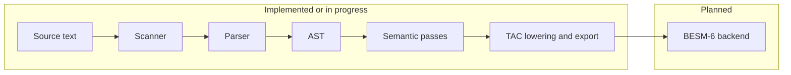

# C Compiler for BESM-6

A C compiler project aimed at the [BESM-6](https://en.wikipedia.org/wiki/BESM-6) mainframe. The long-term idea is a self-hosting toolchain that can help build systems such as the [Unix v7 port for BESM-6](https://github.com/besm6/v7besm) and work with the [Dubna monitor](https://github.com/besm6/dubna).

**This repository is unfinished.** The frontend (lexing, parsing, AST) is in active use; semantic analysis runs in `tacker`; three-address code is produced for a subset of the language and can be exported, while a full TAC pipeline and machine backend remain work in progress. For file-by-file detail, build options, and tests, see [docs/TECHNICAL.md](docs/TECHNICAL.md).

## Goals

* **Self-hosting**: The compiler should eventually compile itself.
* **Unix v7 kernel**: Target use case includes building the [v7besm](https://github.com/besm6/v7besm) kernel.
* **Dubna integration**: Run naturally under the [Dubna](https://github.com/besm6/dubna) environment.

## Current status (what works today)

| Area | Notes |
|------|--------|
| **Build** | CMake-based build; optional `Makefile` wrapper. Unit tests via GoogleTest. |
| **`cast`** | Reads C source and writes an abstract syntax tree (AST): binary `.ast`, or `--yaml` / `--dot` for inspection and graphs. |
| **`tacker`** | Reads a binary AST stream and, per top-level declaration, runs **resolve → typecheck → `label_loops` → `translate` → emit**. Output can be **binary TAC** (default), **YAML-like listing** via the TAC pretty-printer, or **Graphviz DOT** (`tac_graphviz`). Coverage is still **partial**: only constructs handled by `translate_gen.c` lower to TAC; the rest may yield no TAC for that declaration. |
| **TAC** | `tac/` builds **alloc/print/free/compare** plus **`tac_export`** (binary stream) and **`tac_graphviz`**. **`tac_import`** and **YAML TAC export** are not built yet (see `tac/CMakeLists.txt`). Lowering lives in **`translator/translate_gen.c`**. |
| **Preprocessor, assembler, BESM-6 code generation** | **Not in this repo** at this stage. |

If you only want to try the project: build it, run `cast` on a small `.c` file, and open the YAML or DOT output. You can also feed the `.ast` into `tacker` to exercise analysis and TAC emission on supported code. See [Getting started](#getting-started) below.

## How the pieces fit together (architecture)

A compiler is usually described as a pipeline. You can think of it like an assembly line: each stage turns the program into a richer or lower-level representation until it matches the real machine.

1. **Scanner (lexer)** splits the source text into *tokens* (keywords, identifiers, numbers, punctuation).
2. **Parser** builds a *syntax tree* (AST) that matches the grammar of the language.
3. **Semantic analysis** checks meaning: types, scopes, and whether names refer to the right declarations.
4. **Intermediate code** (here, *three-address code*, TAC) is a machine-neutral form that is easier to optimize and translate than raw C syntax.
5. **Backend** (not present yet) would turn TAC into BESM-6 assembly or object code.

Stages 1–3 are largely in place for parsing and checking. Stage 4 is **in progress**: AST is lowered to TAC for a growing subset of the language (`translate_gen`), and TAC can be emitted as **binary**, a **pretty-printed listing** (`--yaml`), or **DOT** (`--dot`); binary **import** and dedicated YAML TAC I/O are still TODO. Stage 5 is future work.



The repository ships two programs: **`cast`** (C → AST) and **`tacker`** (binary AST → analysis and optional TAC output). Details and command lines are in [docs/TECHNICAL.md](docs/TECHNICAL.md#executables-cast-and-tacker).

## Getting started

**You need:** CMake 3.10 or newer, a C11 compiler, and a C++17 compiler (tests only). Make is optional. Network access the first time you configure the project so CMake can fetch GoogleTest.

**Build and test:**

```bash
make          # creates build/, runs cmake, builds
make test     # runs ctest in build/
```

Or with CMake directly:

```bash
cmake -B build -DCMAKE_BUILD_TYPE=RelWithDebInfo
cmake --build build
ctest --test-dir build
```

**Parse a file to YAML** (human-readable tree):

```bash
./build/cast --yaml hello.c hello.yaml
```

**Parse to Graphviz DOT** (for a diagram if you have [Graphviz](https://graphviz.org/) installed):

```bash
./build/cast --dot hello.c hello.dot
dot -Tpng hello.dot -o hello.png
```

**Analyze and emit TAC** (after `cast`; formats match `tacker` options: default binary `.tac`, or `--yaml` / `--dot` for a listing or a TAC graph):

```bash
./build/cast hello.c hello.ast
./build/tacker hello.ast hello.tac
# ./build/tacker --dot hello.ast hello.dot   # Graphviz of TAC
```

For debug logging, verbose mode, and full `tacker` behavior, see [docs/TECHNICAL.md](docs/TECHNICAL.md). Note that **docs/TECHNICAL.md** may still describe older stubs in places; the README status table above reflects the current pipeline.

## Documentation

| Document | Purpose |
|----------|---------|
| [docs/TECHNICAL.md](docs/TECHNICAL.md) | Repository layout, components, build system, tests, ASDL vs C code, development notes, references |
| [grammar/README.md](grammar/README.md) | Notes on the C11 grammar artifacts in `grammar/` |

## License

This project is licensed under the MIT License. See the [LICENSE](LICENSE) file.

Copyright (c) 2025 besm6
