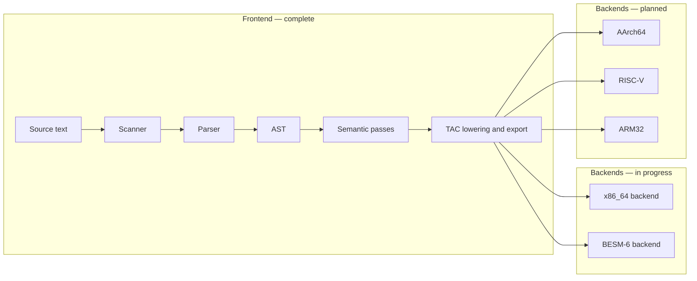

# Multi-Platform C Compiler

A C11 compiler with a shared frontend and pluggable machine backends. Current backends: **x86_64** (System V AMD64 ABI, in progress) and **BESM-6** (in progress). Planned backends: AArch64, RISC-V, ARM32. The long-term BESM-6 goal is a self-hosting toolchain for the [Unix v7 port](https://github.com/besm6/v7besm) and the [Dubna monitor](https://github.com/besm6/dubna).

**This repository is unfinished.** The frontend (lexing, parsing, AST, semantic analysis, and full TAC lowering) is complete. Machine backends are in progress; work plans are tracked in [backend/x86/TODO.md](backend/x86/TODO.md) and [backend/besm6/TODO.md](backend/besm6/TODO.md). For file-by-file detail, build options, and tests, see [docs/Technical_Reference.md](docs/Technical_Reference.md).

## Goals

* **Multi-platform**: A single frontend feeds multiple machine backends; adding a new target requires only a new backend directory.
* **Self-hosting**: The compiler should eventually compile itself.
* **Unix v7 kernel**: Target use case includes building the [v7besm](https://github.com/besm6/v7besm) kernel for BESM-6.
* **Dubna integration**: Run naturally under the [Dubna](https://github.com/besm6/dubna) environment.

## Current status (what works today)

| Area | Notes |
|------|--------|
| **Build** | CMake-based build; optional `Makefile` wrapper. Unit tests via GoogleTest. |
| **`parse`** | Reads C source and writes an abstract syntax tree (AST): binary `.ast`, or `--yaml` / `--dot` for inspection and graphs. |
| **`lower`** | Reads a binary AST stream and, per top-level declaration, runs **typecheck → `translate` → emit**. Output can be **binary TAC** (default), **YAML-like listing** via the TAC pretty-printer, or **Graphviz DOT** (`tac_graphviz`). Semantic analysis handles `typedef` (scoped `typetab`) and full `switch` validation (integer controlling expression with integer promotion; constant integer case values; duplicate-case and multiple-default rejection). TAC lowering is **complete**: arithmetic, control flow, functions (direct and indirect), pointers, arrays, structs, casts, `_Generic`, compound literals, and aggregate initializers all lower correctly. |
| **TAC** | `tac/` builds **alloc/print/free/compare**, **`tac_export`** and **`tac_import`** (binary stream), **`tac_export_yaml`** (YAML listing), and **`tac_graphviz`** (DOT graph). Lowering lives in **`translator/translate.c`**. |
| **x86_64 backend (`genx86`)** | Planned. Work plan in [backend/x86/TODO.md](backend/x86/TODO.md). |
| **BESM-6 backend (`genbesm`)** | Planned. Work plan in [backend/besm6/TODO.md](backend/besm6/TODO.md). |
| **AArch64 / RISC-V / ARM32 backends** | Planned (not started). |
| **Preprocessor, assembler, linker** | Not in this repo. |

**Note:** This compiler intentionally rejects identifier shadowing — a name declared in an inner block that duplicates any name in an enclosing scope is a compile error.

If you only want to try the project: build it, run `parse` on a small `.c` file, and open the YAML or DOT output. You can also feed the `.ast` into `lower` to exercise analysis and TAC emission on supported code. See [Getting started](#getting-started) below.

## How the pieces fit together (architecture)

A compiler is usually described as a pipeline. You can think of it like an assembly line: each stage turns the program into a richer or lower-level representation until it matches the real machine.

1. **Scanner (lexer)** splits the source text into *tokens* (keywords, identifiers, numbers, punctuation).
2. **Parser** builds a *syntax tree* (AST) that matches the grammar of the language.
3. **Semantic analysis** checks meaning: types, scopes, and whether names refer to the right declarations.
4. **Intermediate code** (here, *three-address code*, TAC) is a machine-neutral form that is easier to optimize and translate than raw C syntax.
5. **Backend** translates TAC into target-specific assembly. Current targets: **x86_64** (`genx86`, System V AMD64 ABI) and **BESM-6** (`genbesm`, Madlen / Dubna). Planned: AArch64, RISC-V, ARM32.

Stages 1–3 are fully in place. Stage 4 is **complete**: the entire C11 is lowered to TAC. TAC can be emitted as **binary** or re-imported, listed as **YAML** (`--yaml`), or rendered as **DOT** (`--dot`). Stage 5 is planned for x86_64 and BESM-6.



The repository ships two programs: **`parse`** (C → AST) and **`lower`** (binary AST → analysis and optional TAC output). Details and command lines are in [docs/Technical_Reference.md](docs/Technical_Reference.md#executables-parse-and-lower).

## Getting started

**You need:** CMake 3.10 or newer, a C11 compiler, and a C++17 compiler (tests only). Make is optional. Network access the first time you configure the project so CMake can fetch GoogleTest.

**Build and test:**

```bash
make          # creates build/, runs cmake, builds
make test     # runs ctest in build/
```

Or with CMake directly:

```bash
cmake -B build -DCMAKE_BUILD_TYPE=RelWithDebInfo
cmake --build build
ctest --test-dir build
```

**Parse a file to YAML** (human-readable tree):

```bash
./build/parse --yaml hello.c hello.yaml
```

**Parse to Graphviz DOT** (for a diagram if you have [Graphviz](https://graphviz.org/) installed):

```bash
./build/parse --dot hello.c hello.dot
dot -Tpng hello.dot -o hello.png
```

**Analyze and emit TAC** (after `parse`; formats match `lower` options: default binary `.tac`, or `--yaml` / `--dot` for a listing or a TAC graph):

```bash
./build/parse hello.c hello.ast
./build/lower hello.ast hello.tac
# ./build/lower --dot hello.ast hello.dot   # Graphviz of TAC
```

For debug logging, verbose mode, and full `lower` behavior, see [docs/Technical_Reference.md](docs/Technical_Reference.md).

## Documentation

| Document | Purpose |
|----------|---------|
| [docs/Technical_Reference.md](docs/Technical_Reference.md) | Repository layout, components, build system, tests, ASDL vs C code, development notes, references |
| [docs/Memory_Allocation.md](docs/Memory_Allocation.md) | Memory allocator (`xalloc`) design and usage |
| [docs/String_Map.md](docs/String_Map.md) | `libutil/string_map` key-value store |
| [docs/Word_Oriented_IO.md](docs/Word_Oriented_IO.md) | Word-oriented I/O (`wio`) for binary IR streams |
| [docs/C_Grammar.md](docs/C_Grammar.md) | C grammar article: scanner (`c11.l`), parser (`c11.y`), ASDL (`c11.asdl`), and how they relate to the hand-written implementation |
| [grammar/README.md](grammar/README.md) | Notes on the C11 grammar artifacts in `grammar/` |
| [backend/x86/TODO.md](backend/x86/TODO.md) | x86_64 backend work plan |
| [backend/besm6/TODO.md](backend/besm6/TODO.md) | BESM-6 backend work plan |
| [docs/Besm6_Calling_Conventions.md](docs/Besm6_Calling_Conventions.md) | BESM-6 C calling convention (registers, c/save, c/ret) |
| [docs/Besm6_Instruction_Set.md](docs/Besm6_Instruction_Set.md) | BESM-6 instruction set reference |
| [docs/Madlen.md](docs/Madlen.md) | Madlen assembler syntax for the Dubna monitor |
| [docs/Type_Coercion.md](docs/Type_Coercion.md) | C11 type coercion and arithmetic conversion rules |

## License

This project is licensed under the MIT License. See the [LICENSE](LICENSE) file.

Copyright (c) 2025 besm6
